# Handshaked UDP

**Low-latency UDP through carrier-grade NAT, as a tiny C library.** A client behind CGNAT (Starlink, LTE/5G) and a server with a public IP keep a real-time stream alive in both directions: a handshake opens the path, keep-alives hold the NAT mapping, and connection migration follows the client when the NAT changes its port. No VPN, no relay, no STUN or TURN server.

[](https://github.com/kewl-ua/handshaked_udp/actions/workflows/ci.yml)
[](https://github.com/kewl-ua/handshaked_udp/releases/latest)
[](LICENSE)


It is a minimalist network protocol with `libhudp`, a small C library (POSIX sockets) that implements it, for real-time state streams such as remote control and telemetry, sensor feeds or game state, where only the newest packet matters.

**[Getting Started](docs/getting-started.md)** · [Library Guide](docs/guide.md) · [API Reference](docs/api.md) · [Protocol](docs/protocol.md) · [CGNAT Emulator](docs/emulator.md) · [Benchmark](docs/benchmark.md) · [FAQ](docs/faq.md)

<p align="center">
  
</p>

## 🌐 Why

A device on Starlink or LTE/5G sits behind [carrier-grade NAT](https://en.wikipedia.org/wiki/Carrier-grade_NAT). It has no public address, so nothing can connect to it. The NAT closes UDP mappings that go idle and may change the device's port in the middle of a session. Plain UDP loses the stream, while a VPN or TCP adds a layer, a relay or retransmissions of packets that are already stale. → [The problem in detail](docs/protocol.md#the-problem)

## 🛠 How It Works

1. **The client knocks.** A `CONN_REQ` with a random Session ID opens a NAT mapping, and the server answers with `CONN_ACK`.
2. **Both sides stream** `MSG_DATA`. The server always answers at the address the latest packet came from.
3. **Keep-alives** after 100 ms of silence hold the mapping open, and the server answers each one at once.
4. **When the NAT changes the port**, the server follows the client by its Session ID ([connection migration](docs/protocol.md#connection-migration)). **After a link loss** the client knocks again by itself ([session lifetime](docs/protocol.md#session-lifetime)).

All of it on a [2-byte header](docs/protocol.md#packet-format), with no retransmissions. → [The protocol](docs/protocol.md)

## ⚖️ Plain UDP vs Handshaked UDP

Plain UDP here means an application that sends datagrams to a fixed peer address, with no handshake and no keep-alive.

|                                    | Plain UDP                                 | Handshaked UDP                                              |
|------------------------------------|-------------------------------------------|-------------------------------------------------------------|
| Server → client behind CGNAT       | ✗ dropped until the client sends first    | ✓ the client opens the path with `CONN_REQ`                 |
| Client has nothing to send         | ✗ the NAT mapping expires                 | ✓ keep-alives hold the mapping open                         |
| NAT changes the client's port      | ✗ the server keeps sending to the old one | ✓ the server matches the `Session ID` and follows the client |
| Header overhead                    | 0 bytes                                   | 2 bytes                                                     |
| Retransmissions                    | none                                      | none: stale packets are never resent                        |

Measured behind the [CGNAT emulator](docs/emulator.md), 250 Hz both ways, 20 ± 5 ms and 1 % loss, the share of the server's stream that reached the client:

| Scenario                     | Handshaked UDP                              | Plain UDP                 |
|------------------------------|---------------------------------------------|---------------------------|
| Steady                       | 98.4 %                                      | 98.5 %                    |
| NAT port change every 2 s    | 98.5 %, longest gap 14 ms                   | 24.2 %, never recovered   |
| Client idle for 4 s          | 98.5 %, longest gap 14 ms                   | 49.2 %, never recovered   |
| 2 s link outage              | back about 0.3 s after the link returns     | never recovered           |

→ [Full benchmark](docs/benchmark.md)

## 🚀 Quick Start

```sh
git clone https://github.com/kewl-ua/handshaked_udp.git
cd handshaked_udp
make
./bin/server &              # on the host with the public IP
./bin/client 127.0.0.1      # behind CGNAT: pass the server's public IP
```

Your own client is one loop: take the events, send your state, sleep until the next tick.

```c
hudp_t *client = hudp_client_new("203.0.113.10", HUDP_DEFAULT_PORT, NULL);

for (;;) {
    hudp_event_t ev;

    while (hudp_service(client, &ev, 0) > 0) {   // handshake, keep-alives, reconnects happen in here
        if (ev.type == HUDP_EVENT_DATA) {
            // ev.data, ev.len: a payload from the server
        }
    }

    if (hudp_state(client) == HUDP_STATE_CONNECTED) {
        hudp_send(client, state, sizeof(state));
    }

    sleep_until_next_tick();
}
```

→ A complete echo server and client in [Getting Started](docs/getting-started.md#quick-start-an-echo-server-and-a-client), recipes in the [Library Guide](docs/guide.md), every function in the [API Reference](docs/api.md).

## 📚 Documentation

| Page                                        | What is in it                                                       |
|---------------------------------------------|---------------------------------------------------------------------|
| [Getting Started](docs/getting-started.md)  | build, run the examples, a first echo server and client             |
| [Library Guide](docs/guide.md)              | the event loop, waiting, a 250 Hz stream, `poll()`, timings, pitfalls |
| [API Reference](docs/api.md)                | every function, event, state, error and constant                    |
| [Protocol](docs/protocol.md)                | the problem, handshake, migration, session lifetime, packet format, RFCs |
| [CGNAT Emulator](docs/emulator.md)          | test on one machine with port changes, expiring mappings, delay and loss |
| [Benchmark](docs/benchmark.md)              | hudp against plain UDP in five scenarios                            |
| [Development](docs/development.md)          | repository layout, make targets, tests, CI, Windows                 |
| [FAQ](docs/faq.md)                          | Starlink, STUN/TURN/ICE, VPNs, symmetric NAT, security, bandwidth   |

## ❓ FAQ

- [How do I reach a device behind Starlink or mobile CGNAT from the internet?](docs/faq.md#how-do-i-reach-a-device-behind-starlink-or-mobile-cgnat-from-the-internet)
- [How is this different from STUN, TURN and ICE (WebRTC)?](docs/faq.md#how-is-this-different-from-stun-turn-and-ice-webrtc)
- [Why not a VPN such as WireGuard or Tailscale, or just TCP?](docs/faq.md#why-not-a-vpn-such-as-wireguard-or-tailscale-or-just-tcp)
- [Is it encrypted or authenticated?](docs/faq.md#is-it-encrypted-or-authenticated)
- [All questions →](docs/faq.md)

## 📄 License

[MIT](LICENSE): use it in open or closed source projects, keep the copyright notice.
