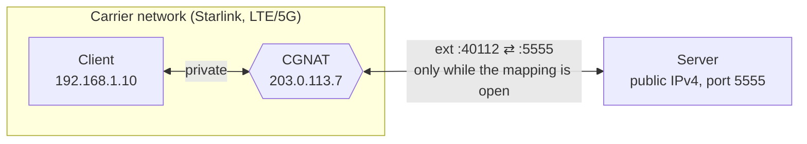
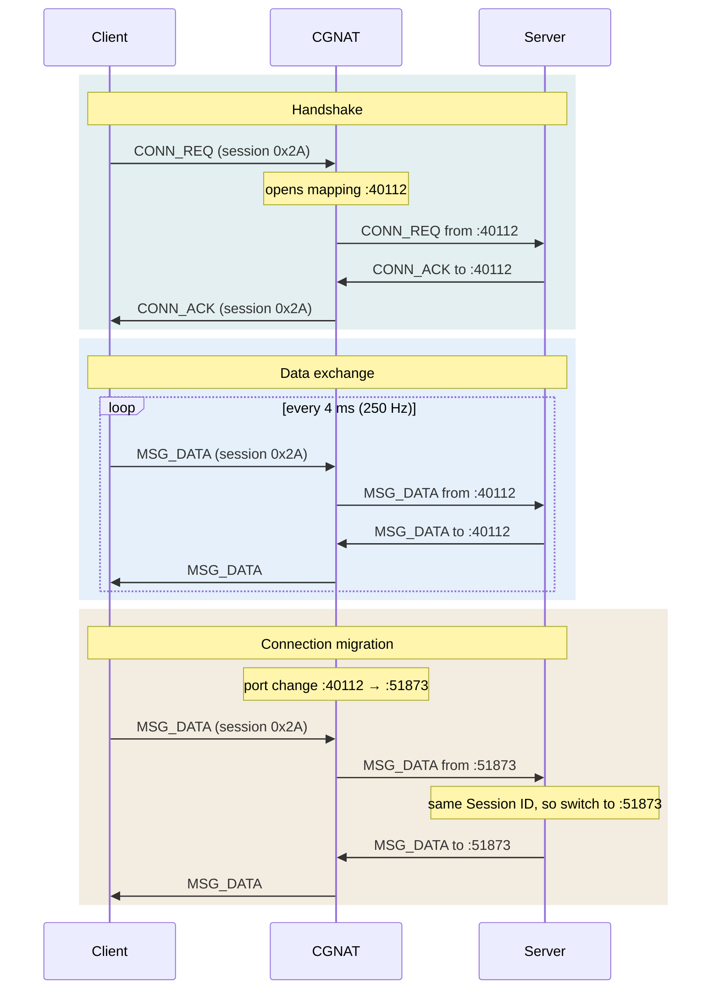

# Handshaked UDP

[](https://github.com/kewl-ua/handshaked_udp/actions/workflows/ci.yml)

A minimalist network protocol for low-latency bidirectional UDP streams between a client behind carrier-grade NAT and a server with a public IP, with `libhudp`, a small C library (POSIX sockets) that implements it.

It handles CGNAT directly, without relying on third-party VPNs, proxies, or relay servers.

<p align="center">
  
</p>

---

## 🌐 Background & The Problem

Standard UDP communication topologies fail when one side sits behind a provider-level NAT:

1. **No Public IP on the Client:** Satellite and cellular carriers (Starlink, LTE/5G) use **CGNAT (Carrier-Grade NAT)**. The client does not have a unique external public IP address, making it impossible to establish an inbound connection from the internet.
2. **Unstable Port Mappings:** The NAT dynamically closes inactive UDP mappings and may change the client's external port mid-session.
3. **Latency-Critical Streams:** For real-time state streams only the most recent packet matters. Layering overlay networks (VPNs, WireGuard, Tailscale) or using guaranteed delivery protocols (TCP, KCP) introduces encryption overhead and jitter caused by retransmitting packets that are already stale.



---

## 🛠 Solution Architecture

Instead of utilizing an external proxy or relay server, this protocol implements dynamic session retention (**UDP Hole Punching / Keep-Alive**) directly at the application layer.

### Communication Flow:
1. **The Server** hosts a static, public IPv4 address and listens on a fixed UDP port (`5555` by default).
2. **The Client** generates a random `Session ID` and repeatedly sends `CONN_REQ` packets to the server. This outbound packet forces the NAT to map and open an ephemeral external port.
3. **The Server** receives the request, extracts the client's public IP and port via `recvfrom`, and replies with a `CONN_ACK` carrying the same `Session ID`. The Handshake is complete.
4. **Data Exchange:** Both sides send `MSG_DATA` packets (the example client every 4 ms, 250 Hz). The server always sends to the address the latest packet of the session came from. When a side has had nothing to send for 100 ms, it sends an empty `MSG_DATA` as a keep-alive, so the NAT mapping never goes idle.

### Connection Migration (Port-Hop Protection):
If the NAT drops the mapping mid-session and assigns a new external port to the client, the server sees it in the source address of the next incoming packet. The server validates the `Session ID` and sends its reply to the new address without dropping the session.



### Session Lifetime:
- **Link loss:** a side that hears nothing of the session for 1 s declares the peer lost. The client then starts a new handshake with a fresh `Session ID`, so stale packets of the old session can't mix in.
- **Session protection:** while a session is alive, the server ignores `CONN_REQ` with any other `Session ID`. A restarted client is accepted once the old session has timed out.
- **Lost `CONN_ACK`:** the client keeps repeating `CONN_REQ`, and the server answers every repeat of the current session.

---

## ⚖️ Plain UDP vs Handshaked UDP

Plain UDP here means an application that sends datagrams to a fixed peer address, with no handshake and no keep-alive.

|                                    | Plain UDP                                 | Handshaked UDP                                              |
|------------------------------------|-------------------------------------------|-------------------------------------------------------------|
| Server → client behind CGNAT       | ✗ dropped until the client sends first    | ✓ the client opens the path with `CONN_REQ`                 |
| Client has nothing to send         | ✗ the NAT mapping expires                 | ✓ keep-alives hold the mapping open                         |
| NAT changes the client's port      | ✗ the server keeps sending to the old one | ✓ the server matches the `Session ID` and follows the client |
| Header overhead                    | 0 bytes                                   | 2 bytes                                                     |
| Retransmissions                    | none                                      | none: stale packets are never resent                        |

---

## 📦 Packet Structure

The header is packed down to a mere **2 bytes** to minimize overhead at high packet rates:

```text
 0                   1                   2
 0 1 2 3 4 5 6 7 8 9 0 1 2 3 4 5 6 7 8 9 0 1 2 3 ...
+-+-+-+-+-+-+-+-+-+-+-+-+-+-+-+-+-+-+-+-+-+-+-+-+-
|  Packet Type  |  Session ID   |  Payload ...
+-+-+-+-+-+-+-+-+-+-+-+-+-+-+-+-+-+-+-+-+-+-+-+-+-
```

| Packet Type    | Value  | Direction       | Payload          |
|----------------|--------|-----------------|------------------|
| `MSG_CONN_REQ` | `0x01` | client → server | none             |
| `MSG_CONN_ACK` | `0x02` | server → client | none             |
| `MSG_DATA`     | `0x03` | both            | application data, empty for a keep-alive |

---

## 📚 Library

`libhudp` is single-threaded and never blocks unless asked to: the application drives it from its own loop and picks up events with `hudp_service()`. The full API is in [`include/hudp.h`](include/hudp.h).

```c
#include "hudp.h"

hudp_t *h = hudp_client_new("203.0.113.10", HUDP_DEFAULT_PORT, NULL);

for (;;) {
    hudp_event_t ev;

    while (hudp_service(h, &ev, 0) > 0) {
        switch (ev.type) {
        case HUDP_EVENT_CONNECTED: /* session established */ break;
        case HUDP_EVENT_DATA:      use(ev.data, ev.len); break;
        case HUDP_EVENT_LOST:      /* the client re-handshakes by itself */ break;
        default: break;
        }
    }

    if (hudp_state(h) == HUDP_STATE_CONNECTED) {
        hudp_send(h, payload, len);
    }

    sleep_until_next_tick(); // the send rate is up to the application
}
```

A server is the same loop around `hudp_server_new(port, NULL)`, and it also gets `HUDP_EVENT_MIGRATED` when the client's address changes. Timings come from `hudp_config_t`:

| Field                   | Default | Meaning                                         |
|-------------------------|---------|-------------------------------------------------|
| `handshake_interval_ms` | 250     | how often the client repeats `CONN_REQ`         |
| `keepalive_interval_ms` | 100     | send silence after which a keep-alive goes out  |
| `link_timeout_ms`       | 1000    | receive silence after which the peer is lost    |

---

## 🔧 Build & Run

Linux / POSIX with `gcc` or `clang`:

```sh
make                        # lib/libhudp.a, the examples bin/server and bin/client, bin/natemu
make test                   # library tests, CGNAT scenario tests and two smoke tests
make bench                  # hudp vs plain UDP behind the CGNAT emulator, about 80 s
./bin/server                # on the host with the public IP, listens on UDP 5555
./bin/client 203.0.113.10   # behind CGNAT, pass the server's public IP
```

To use the library in your own program, compile with `-I include` and link `lib/libhudp.a`.

On Windows, build in the **MSYS** shell of [MSYS2](https://www.msys2.org/) (`pacman -S gcc make`). The MinGW environments have no POSIX sockets.

---

## 🧪 CGNAT Emulator & Benchmark

`natemu` ([`tools/natemu.h`](tools/natemu.h)) is a userspace CGNAT: a UDP relay that gives each client a mapping with its own public port, lets in only replies from the address the mapping sent to, refreshes a mapping only on outbound traffic and drops it after an idle timeout. Like on Starlink, the lossy link sits on the client side of the NAT: delay, jitter (packets may overtake each other), loss and duplication come from a seeded generator, so runs are reproducible. A port change (a handover) and a link outage can be triggered at any moment.

The tests and the benchmark embed it in-process. As a standalone relay it fits in front of any UDP server on the same host:

```sh
./bin/server 6000 &
./bin/natemu --listen 5555 --server 127.0.0.1:6000 --delay 20 --jitter 5 --loss 1 --rebind-every 3000 &
./bin/client 127.0.0.1      # the server logs "Client moved to ..." every 3 s and the session holds
```

`make bench` streams 250 Hz both ways for 8 s per case and compares against plain UDP (fixed peer address, no handshake, no keep-alive). One local run, Windows 11 + MSYS2, GCC 15.3, with the NAT mapping timeout compressed to 2 s:

| Scenario | Protocol | Up delivered | Down delivered | Down latency p50 / p99 | First down packet | Longest down gap | hudp events |
|---|---|---|---|---|---|---|---|
| Clean link | hudp | 100.0 % | 100.0 % | 0.0 / 0.1 ms | 4 ms | 4 ms | — |
|  | plain UDP | 100.0 % | 100.0 % | 0.0 / 0.1 ms | 4 ms | 4 ms | — |
| Starlink-like: 20 ± 5 ms, 1 % loss | hudp | 98.5 % | 98.4 % | 19.9 / 24.9 ms | 54 ms | 15 ms | — |
|  | plain UDP | 99.1 % | 98.5 % | 19.9 / 24.9 ms | 40 ms | 15 ms | — |
| + NAT port change every 2 s | hudp | 98.3 % | 98.5 % | 20.0 / 24.9 ms | 54 ms | 14 ms | 3 migrations |
|  | plain UDP | 99.0 % | 24.2 % | 19.6 / 24.9 ms | 40 ms | never recovered | — |
| + client idle for 4 s | hudp | 97.4 % | 98.5 % | 20.0 / 24.9 ms | 54 ms | 14 ms | — |
|  | plain UDP | 98.8 % | 49.2 % | 19.9 / 24.9 ms | 40 ms | never recovered | — |
| + 2 s link outage | hudp | 69.8 % | 69.9 % | 19.9 / 24.9 ms | 54 ms | 2304 ms | 1 lost, 1 reconnects |
|  | plain UDP | 74.0 % | 36.3 % | 19.7 / 24.9 ms | 40 ms | never recovered | — |

The handshake costs hudp about 14 ms before the first packet. In exchange, a port change costs it no more than ordinary jitter, keep-alives hold the mapping through silence, and after an outage it reconnects about 0.3 s after the link returns. Plain UDP's downlink dies at the first port change or mapping expiry and never comes back. CI publishes a fresh table in every run's summary.
