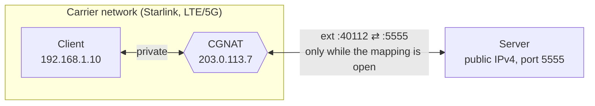
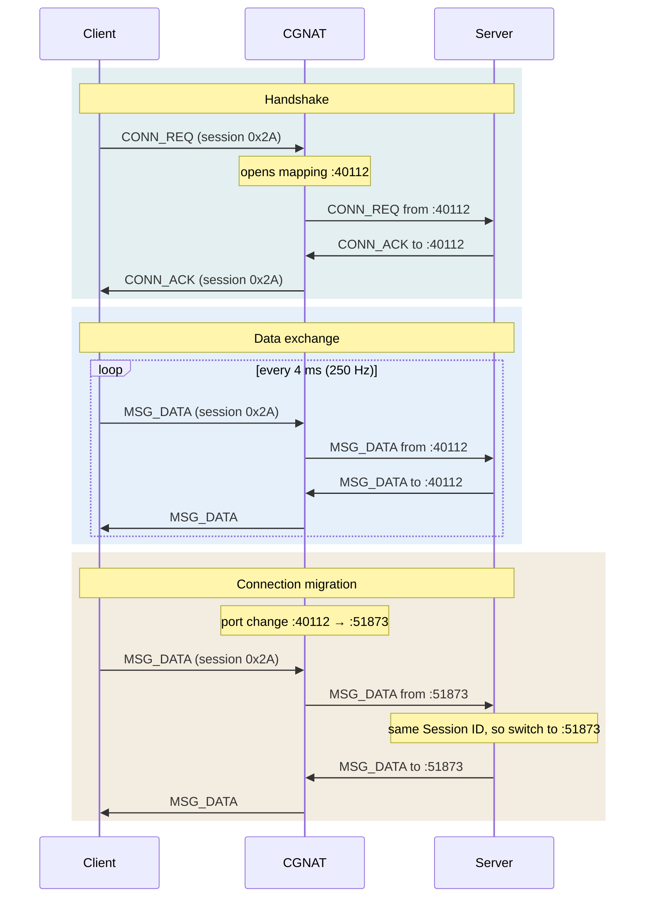
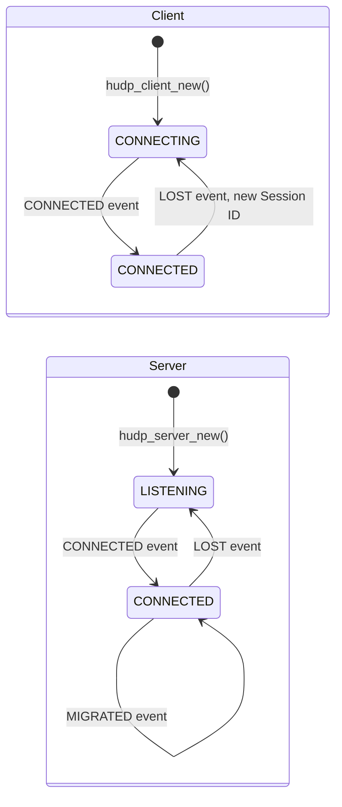

# Handshaked UDP

**Low-latency UDP through carrier-grade NAT, as a tiny C library.** A client behind CGNAT (Starlink, LTE/5G) and a server with a public IP keep a real-time stream alive in both directions: a handshake opens the path, keep-alives hold the NAT mapping, and connection migration follows the client when the NAT changes its port. No VPN, no relay, no STUN or TURN server.

[](https://github.com/kewl-ua/handshaked_udp/actions/workflows/ci.yml)
[](https://github.com/kewl-ua/handshaked_udp/releases/latest)
[](LICENSE)


It is a minimalist network protocol with `libhudp`, a small C library (POSIX sockets) that implements it, for real-time state streams such as remote control and telemetry, sensor feeds or game state, where only the newest packet matters.

**Contents:** [The Problem](#-background--the-problem) · [Solution](#-solution-architecture) · [Plain UDP vs Handshaked UDP](#️-plain-udp-vs-handshaked-udp) · [Packet Structure](#-packet-structure) · [Using the Library](#-using-the-library) · [Build & Run](#-build--run) · [CGNAT Emulator & Benchmark](#-cgnat-emulator--benchmark) · [FAQ](#-faq) · [License](#-license)

<p align="center">
  
</p>

---

## 🌐 Background & The Problem

Standard UDP communication topologies fail when one side sits behind a provider-level NAT:

1. **No Public IP on the Client:** Satellite and cellular carriers (Starlink, LTE/5G) use **CGNAT (Carrier-Grade NAT)**. The client does not have a unique external public IP address, making it impossible to establish an inbound connection from the internet.
2. **Unstable Port Mappings:** The NAT dynamically closes inactive UDP mappings and may change the client's external port mid-session.
3. **Latency-Critical Streams:** For real-time state streams only the most recent packet matters. Layering overlay networks (VPNs, WireGuard, Tailscale) or using guaranteed delivery protocols (TCP, KCP) introduces encryption overhead and jitter caused by retransmitting packets that are already stale.



---

## 🛠 Solution Architecture

Instead of utilizing an external proxy or relay server, this protocol implements dynamic session retention (**UDP Hole Punching / Keep-Alive**) directly at the application layer.

### Communication Flow:
1. **The Server** hosts a static, public IPv4 address and listens on a fixed UDP port (`5555` by default).
2. **The Client** generates a random `Session ID` and repeatedly sends `CONN_REQ` packets to the server. This outbound packet forces the NAT to map and open an ephemeral external port.
3. **The Server** receives the request, extracts the client's public IP and port via `recvfrom`, and replies with a `CONN_ACK` carrying the same `Session ID`. The Handshake is complete.
4. **Data Exchange:** Both sides send `MSG_DATA` packets (the example client every 4 ms, 250 Hz). The server always sends to the address the latest packet of the session came from. When a side has had nothing to send for 100 ms, it sends an empty `MSG_DATA` as a keep-alive, so the NAT mapping never goes idle. The server answers a client keep-alive at once, while the mapping it has just refreshed is sure to be open.

### Connection Migration (Port-Hop Protection):
If the NAT drops the mapping mid-session and assigns a new external port to the client, the server sees it in the source address of the next incoming packet. The server validates the `Session ID` and sends its reply to the new address without dropping the session.



### Session Lifetime:
- **Link loss:** a side that hears nothing of the session for 1 s declares the peer lost. The client then starts a new handshake with a fresh `Session ID`, so stale packets of the old session can't mix in.
- **Session protection:** while a session is alive, the server ignores `CONN_REQ` with any other `Session ID`. A restarted client is accepted once the old session has timed out.
- **Lost `CONN_ACK`:** the client keeps repeating `CONN_REQ`, and the server answers every repeat of the current session.

---

## ⚖️ Plain UDP vs Handshaked UDP

Plain UDP here means an application that sends datagrams to a fixed peer address, with no handshake and no keep-alive.

|                                    | Plain UDP                                 | Handshaked UDP                                              |
|------------------------------------|-------------------------------------------|-------------------------------------------------------------|
| Server → client behind CGNAT       | ✗ dropped until the client sends first    | ✓ the client opens the path with `CONN_REQ`                 |
| Client has nothing to send         | ✗ the NAT mapping expires                 | ✓ keep-alives hold the mapping open                         |
| NAT changes the client's port      | ✗ the server keeps sending to the old one | ✓ the server matches the `Session ID` and follows the client |
| Header overhead                    | 0 bytes                                   | 2 bytes                                                     |
| Retransmissions                    | none                                      | none: stale packets are never resent                        |

---

## 📦 Packet Structure

The header is packed down to a mere **2 bytes** to minimize overhead at high packet rates:

```text
 0                   1                   2
 0 1 2 3 4 5 6 7 8 9 0 1 2 3 4 5 6 7 8 9 0 1 2 3 ...
+-+-+-+-+-+-+-+-+-+-+-+-+-+-+-+-+-+-+-+-+-+-+-+-+-
|  Packet Type  |  Session ID   |  Payload ...
+-+-+-+-+-+-+-+-+-+-+-+-+-+-+-+-+-+-+-+-+-+-+-+-+-
```

| Packet Type    | Value  | Direction       | Payload          |
|----------------|--------|-----------------|------------------|
| `MSG_CONN_REQ` | `0x01` | client → server | none             |
| `MSG_CONN_ACK` | `0x02` | server → client | none             |
| `MSG_DATA`     | `0x03` | both            | application data, empty for a keep-alive |

---

## 📚 Using the Library

### How It Works in 30 Seconds

- There are two kinds of **endpoint**. The **client** sits behind CGNAT and starts the conversation. The **server** has a public IP and waits for a client. A server talks to one client at a time.
- Your program owns the loop. In it you call **`hudp_service()`**. It reads incoming packets and does all the protocol work: the handshake, keep-alives, noticing a dead link, reconnecting, following the client to a new port. Whatever matters to you comes back as an **event**, one per call.
- Whenever you have something to send, you call **`hudp_send()`**. Each packet travels on its own: nothing is retransmitted or reordered, because in a live stream only the newest packet matters.
- There are no threads, callbacks or background timers. Nothing happens between your calls, so you decide when the library runs.



### Quick Start: an Echo Server and a Client

Two complete programs: the server sends every payload back, the client sends a numbered message once a second and prints the echoes. After `make`, build them like this:

```sh
gcc -Wall -I include echo_server.c lib/libhudp.a -o echo_server
gcc -Wall -I include echo_client.c lib/libhudp.a -o echo_client
```

```c
// echo_server.c: sends every payload back to the client
#include <stdio.h>

#include "hudp.h"

int main(void) {
    hudp_t *server = hudp_server_new(HUDP_DEFAULT_PORT, NULL); // UDP 5555, default timings

    if (!server) {
        perror("hudp_server_new");
        return 1;
    }

    printf("Waiting for a client on port %d...\n", HUDP_DEFAULT_PORT);

    while (1) {
        hudp_event_t ev;
        int res = hudp_service(server, &ev, -1); // Sleep until something happens

        if (res < 0) {
            perror("hudp_service");
            break;
        }

        if (res == 0) {
            continue; // No event: nothing to do
        }

        switch (ev.type) {
        case HUDP_EVENT_CONNECTED:
            printf("Client connected, session %d\n", ev.session_id);
            break;
        case HUDP_EVENT_DATA:
            hudp_send(server, ev.data, ev.len); // Goes to the client's latest address
            break;
        case HUDP_EVENT_MIGRATED: {
            char addr[32];

            hudp_peer(server, addr, sizeof(addr));
            printf("The NAT gave the client a new port, now %s\n", addr);
            break;
        }
        case HUDP_EVENT_LOST:
            printf("Client lost, waiting for the next one\n");
            break;
        default:
            break;
        }
    }

    hudp_free(server);
    return 0;
}
```

```c
// echo_client.c: sends a numbered message once a second and prints what comes back
#include <stdio.h>
#include <time.h>

#include "hudp.h"

int main(int argc, char *argv[]) {
    const char *server_ip = argc > 1 ? argv[1] : "127.0.0.1";
    hudp_t *client = hudp_client_new(server_ip, HUDP_DEFAULT_PORT, NULL);

    if (!client) {
        perror("hudp_client_new"); // EINVAL: server_ip is not a valid IPv4 address
        return 1;
    }

    time_t next_send = 0;
    unsigned counter = 0;

    while (1) {
        hudp_event_t ev;
        int res = hudp_service(client, &ev, 100); // Wait up to 100 ms for an event

        if (res < 0) {
            perror("hudp_service");
            break;
        }

        if (res > 0) {
            switch (ev.type) {
            case HUDP_EVENT_CONNECTED:
                printf("Connected, session %d\n", ev.session_id);
                break;
            case HUDP_EVENT_DATA:
                printf("Echo: %.*s\n", (int)ev.len, (const char *)ev.data);
                break;
            case HUDP_EVENT_LOST:
                printf("Server lost, reconnecting...\n"); // The library knocks again by itself
                break;
            default:
                break;
            }
        }

        // hudp_send() fails with ENOTCONN until the handshake is done, so check the state first
        if (hudp_state(client) == HUDP_STATE_CONNECTED && time(NULL) >= next_send) {
            char msg[32];
            int len = snprintf(msg, sizeof(msg), "hello #%u", counter++);

            hudp_send(client, msg, (size_t)len);
            next_send = time(NULL) + 1;
        }
    }

    hudp_free(client);
    return 0;
}
```

Start the server, then the client. Now stop the server: a second later the client prints `Server lost, reconnecting...`. Start the server again and the client prints `Connected` with a new session and carries on, without any reconnect code of yours. Messages sent while the server was down are simply gone.

### Waiting: the `timeout_ms` of `hudp_service()`

| `timeout_ms` | What the call does                                                   | Good for                                   |
|--------------|----------------------------------------------------------------------|--------------------------------------------|
| `-1`         | sleeps until there is an event                                        | servers that only react to the client      |
| `N > 0`      | waits up to `N` ms, returns `0` if nothing happened                   | loops that also do something periodically  |
| `0`          | never waits                                                           | fixed-rate loops that sleep on their own   |

One call returns at most one event, so in a fixed-rate loop take them all with `while (hudp_service(h, &ev, 0) > 0)`. Keep-alives and timeouts only run inside `hudp_service()`, so call it at least every `keepalive_interval_ms` (100 ms by default). While it waits, with `-1` or `N`, it wakes up for those timers by itself.

### Recipe: a 250 Hz Stream Where Only the Newest Packet Counts

The pattern of [`examples/client.c`](examples/client.c): once per tick, take everything that has arrived and keep only the newest payload, send the current state, then sleep until the next tick.

```c
// stream_client.c: a 250 Hz stream that always acts on the newest packet from the server
#include <stdio.h>
#include <string.h>
#include <time.h>

#include "hudp.h"

#define TICK_NS 4000000L // 4 ms: 250 Hz

int main(void) {
    hudp_t *client = hudp_client_new("127.0.0.1", HUDP_DEFAULT_PORT, NULL);

    if (!client) {
        perror("hudp_client_new");
        return 1;
    }

    uint8_t latest[HUDP_MAX_PAYLOAD]; // The newest payload from the server
    size_t latest_len = 0;
    struct timespec next_tick;

    clock_gettime(CLOCK_MONOTONIC, &next_tick);

    while (1) {
        hudp_event_t ev;

        // 1. Take everything that arrived since the last tick. ev.data is only valid
        //    until the next hudp_service() call, so the newest payload is copied out.
        while (hudp_service(client, &ev, 0) > 0) {
            if (ev.type == HUDP_EVENT_DATA) {
                memcpy(latest, ev.data, ev.len);
                latest_len = ev.len;
            }
        }

        // 2. Act on the newest state only
        if (latest_len > 0) {
            // Hand latest[0 .. latest_len) to whatever consumes it
        }

        // 3. Send this tick's state
        if (hudp_state(client) == HUDP_STATE_CONNECTED) {
            uint8_t state[26] = {0}; // Fill with your data

            hudp_send(client, state, sizeof(state));
        }

        // 4. Sleep until the next tick. An absolute deadline does not drift,
        //    however long steps 1-3 took.
        next_tick.tv_nsec += TICK_NS;

        if (next_tick.tv_nsec >= 1000000000L) {
            next_tick.tv_nsec -= 1000000000L;
            next_tick.tv_sec += 1;
        }

        clock_nanosleep(CLOCK_MONOTONIC, TIMER_ABSTIME, &next_tick, NULL);
    }

    hudp_free(client);
    return 0;
}
```

### Recipe: Next to Other Input and Output with `poll()`

`hudp_fd()` gives you the socket to wait on together with your own descriptors: a serial port, a pipe, stdin. Here lines typed into a server's terminal go to the client. Only wait on the descriptor; reading it is `hudp_service()`'s job.

```c
// console_server.c: lines typed on stdin go to the client, the client's payloads are printed
#include <poll.h>
#include <stdio.h>
#include <string.h>
#include <unistd.h>

#include "hudp.h"

int main(void) {
    hudp_t *server = hudp_server_new(HUDP_DEFAULT_PORT, NULL);

    if (!server) {
        perror("hudp_server_new");
        return 1;
    }

    struct pollfd fds[2] = {
        { .fd = hudp_fd(server), .events = POLLIN },
        { .fd = STDIN_FILENO, .events = POLLIN },
    };

    while (1) {
        // Wake up on network traffic or input, and at least every 50 ms for the protocol's timers
        poll(fds, 2, 50);

        hudp_event_t ev;

        while (hudp_service(server, &ev, 0) > 0) {
            if (ev.type == HUDP_EVENT_DATA) {
                printf("client: %.*s\n", (int)ev.len, (const char *)ev.data);
            }
        }

        if (fds[1].revents & POLLIN) {
            char line[256];

            if (!fgets(line, sizeof(line), stdin)) {
                break; // End of input
            }

            if (hudp_send(server, line, strlen(line)) < 0) {
                perror("Not sent"); // ENOTCONN while no client is connected
            }
        }
    }

    hudp_free(server);
    return 0;
}
```

### Recipe: Your Own Timings

Start from the defaults and change what you need. Keep the same values on both sides.

```c
hudp_config_t cfg;

hudp_config_default(&cfg);
cfg.link_timeout_ms = 3000;       // Tolerate up to 3 s of silence before LOST
cfg.handshake_interval_ms = 100;  // Knock more often while connecting

hudp_t *client = hudp_client_new("203.0.113.10", HUDP_DEFAULT_PORT, &cfg);
```

| Field                   | Default | Meaning                                                        | Rule of thumb                                                        |
|-------------------------|---------|----------------------------------------------------------------|----------------------------------------------------------------------|
| `handshake_interval_ms` | 250     | how often a connecting client repeats `CONN_REQ`               | a bit above the round-trip time                                      |
| `keepalive_interval_ms` | 100     | send silence after which an empty keep-alive goes out          | far below the NAT's mapping timeout and below `link_timeout_ms`      |
| `link_timeout_ms`       | 1000    | receive silence after which the peer is lost (`LOST` event)    | shorter notices a dead link sooner, longer rides out loss bursts     |

### API Reference

Everything is declared in [`include/hudp.h`](include/hudp.h). Functions that can fail return `NULL` or `-1` and set `errno`.

#### Creating and Destroying

**`hudp_t *hudp_client_new(const char *server_ip, uint16_t port, const hudp_config_t *cfg)`**\
Creates a client for the server at `server_ip` (dotted IPv4, like `"203.0.113.10"`) and `port`. Pass `NULL` as `cfg` for the default timings. Nothing is sent yet: the first `hudp_service()` call sends the first `CONN_REQ`. Returns `NULL` on failure, with `errno` set to `EINVAL` for a malformed address or to the socket error.

**`hudp_t *hudp_server_new(uint16_t port, const hudp_config_t *cfg)`**\
Creates a server that listens on `port` on all interfaces. Returns `NULL` on failure, for example with `errno` set to `EADDRINUSE` when the port is taken.

**`void hudp_free(hudp_t *h)`**\
Closes the socket and frees the endpoint. `NULL` is fine. Nothing is sent to the peer: it notices through its link timeout.

**`void hudp_config_default(hudp_config_t *cfg)`**\
Fills `cfg` with the default timings, so you only change the fields you care about.

#### Running

**`int hudp_service(hudp_t *h, hudp_event_t *ev, int timeout_ms)`**\
Does the protocol work and reports what happened. Returns `1` and fills `ev` when there is an event, `0` when `timeout_ms` ran out without one (`ev` is left untouched), `-1` on a socket error. One event per call; see [Waiting](#waiting-the-timeout_ms-of-hudp_service) for `timeout_ms`.

#### Sending

**`int hudp_send(hudp_t *h, const void *payload, size_t len)`**\
Sends one packet of `len` bytes, up to `HUDP_MAX_PAYLOAD`. A server sends to the client's latest address. Returns `0` when the packet has left. That says nothing about it arriving: there is no acknowledgement and no retransmission. Returns `-1` with `errno`:

| `errno`       | Meaning                                                                   |
|---------------|---------------------------------------------------------------------------|
| `ENOTCONN`    | no session: the client is still handshaking, or the server has no client  |
| `EMSGSIZE`    | `len` is above `HUDP_MAX_PAYLOAD`                                         |
| anything else | the socket error, e.g. `ECONNREFUSED` while the server is down; it passes  |

An empty payload (`len` 0) is a keep-alive: it keeps the session alive but never shows up as `HUDP_EVENT_DATA`.

#### Inspecting

**`hudp_state_t hudp_state(const hudp_t *h)`**\
The current state, see the table below. Check for `HUDP_STATE_CONNECTED` before sending.

**`int hudp_peer(const hudp_t *h, char *buf, size_t cap)`**\
Writes the peer address as `"ip:port"`: the server's for a client, the client's latest for a server. 22 bytes are always enough. Returns `-1` when there is no peer yet.

**`int hudp_fd(const hudp_t *h)`**\
The socket descriptor, to wait on with `poll()`, `select()` or `epoll`. Never read from it or close it yourself.

#### Events (`hudp_event_t`)

| Field        | Meaning                                                                  |
|--------------|--------------------------------------------------------------------------|
| `type`       | one of the events below                                                  |
| `session_id` | the session the event belongs to (1 to 255)                              |
| `data`       | `HUDP_EVENT_DATA` only: the payload, valid until the next `hudp_service()` |
| `len`        | `HUDP_EVENT_DATA` only: the payload size in bytes                        |

| Event                  | Client | Server | When                                                                                   |
|------------------------|:------:|:------:|----------------------------------------------------------------------------------------|
| `HUDP_EVENT_CONNECTED` | ✓      | ✓      | the handshake is done and data can flow                                                |
| `HUDP_EVENT_DATA`      | ✓      | ✓      | a payload arrived                                                                      |
| `HUDP_EVENT_MIGRATED`  |        | ✓      | the client's address changed (a NAT port change); replies already go to the new one   |
| `HUDP_EVENT_LOST`      | ✓      | ✓      | nothing heard for `link_timeout_ms`; a client starts a new handshake by itself, a server waits for a client |

#### States (`hudp_state_t`)

| State                  | Who    | Meaning                                         |
|------------------------|--------|-------------------------------------------------|
| `HUDP_STATE_LISTENING`  | server | waiting for a client                            |
| `HUDP_STATE_CONNECTING` | client | sending `CONN_REQ`, waiting for `CONN_ACK`      |
| `HUDP_STATE_CONNECTED`  | both   | the session is up, `hudp_send()` works          |

#### Constants

| Constant            | Value | Meaning                                                    |
|---------------------|-------|------------------------------------------------------------|
| `HUDP_DEFAULT_PORT` | 5555  | the port the examples use                                  |
| `HUDP_MAX_PAYLOAD`  | 1200  | the largest payload, so a packet stays well below a 1500-byte MTU |

### Things to Know

- **No delivery guarantee and no order.** A packet can be lost, and with jitter a later one can arrive first. If order matters to you, put a counter in your payload and drop anything older than what you already have.
- **`ev.data` is borrowed.** It points into the library's buffer and is valid only until the next `hudp_service()` call on that endpoint. Copy it if you need it later.
- **Keep calling `hudp_service()`.** At least every `keepalive_interval_ms`, otherwise keep-alives stop and the NAT mapping may close.
- **One thread per endpoint.** An endpoint is not thread-safe. Different endpoints can live in different threads.
- **One client per server.** While a session is alive, a server ignores other clients. A new client is accepted once the old one has been silent for `link_timeout_ms`.
- **IPv4 only, payloads up to 1200 bytes.**

### Adding It to Your Project

Build the static library and link it:

```sh
make                                            # builds lib/libhudp.a
gcc -Wall -I handshaked_udp/include app.c handshaked_udp/lib/libhudp.a -o app
```

Or copy `include/hudp.h`, `src/hudp.c` and `src/protocol.h` into your source tree and compile `hudp.c` with the rest of your code. It needs nothing but libc and POSIX sockets.

---

## 🔧 Build & Run

Linux / POSIX with `gcc` or `clang`:

```sh
make                        # lib/libhudp.a, the examples bin/server and bin/client, bin/natemu
make test                   # library tests, CGNAT scenario tests and two smoke tests
make bench                  # hudp vs plain UDP behind the CGNAT emulator, about 80 s
./bin/server                # on the host with the public IP, listens on UDP 5555
./bin/client 203.0.113.10   # behind CGNAT, pass the server's public IP
```

To use the library in your own program, compile with `-I include` and link `lib/libhudp.a`.

On Windows, build in the **MSYS** shell of [MSYS2](https://www.msys2.org/) (`pacman -S gcc make`). The MinGW environments have no POSIX sockets.

---

## 🧪 CGNAT Emulator & Benchmark

`natemu` ([`tools/natemu.h`](tools/natemu.h)) is a userspace CGNAT: a UDP relay that gives each client a mapping with its own public port, lets in only replies from the address the mapping sent to, refreshes a mapping only on outbound traffic and drops it after an idle timeout. Like on Starlink, the lossy link sits on the client side of the NAT: delay, jitter (packets may overtake each other), loss and duplication come from a seeded generator, so runs are reproducible. A port change (a handover) and a link outage can be triggered at any moment.

The tests and the benchmark embed it in-process. As a standalone relay it fits in front of any UDP server on the same host:

```sh
./bin/server 6000 &
./bin/natemu --listen 5555 --server 127.0.0.1:6000 --delay 20 --jitter 5 --loss 1 --rebind-every 3000 &
./bin/client 127.0.0.1      # the server logs "Client moved to ..." every 3 s and the session holds
```

`make bench` streams 250 Hz both ways for 8 s per case and compares against plain UDP (fixed peer address, no handshake, no keep-alive). One local run, Windows 11 + MSYS2, GCC 15.3, with the NAT mapping timeout compressed to 2 s:

| Scenario | Protocol | Up delivered | Down delivered | Down latency p50 / p99 | First down packet | Longest down gap | hudp events |
|---|---|---|---|---|---|---|---|
| Clean link | hudp | 100.0 % | 100.0 % | 0.0 / 0.1 ms | 4 ms | 4 ms | — |
|  | plain UDP | 100.0 % | 100.0 % | 0.0 / 0.1 ms | 4 ms | 4 ms | — |
| Starlink-like: 20 ± 5 ms, 1 % loss | hudp | 98.5 % | 98.4 % | 19.9 / 24.9 ms | 54 ms | 15 ms | — |
|  | plain UDP | 99.1 % | 98.5 % | 19.9 / 24.9 ms | 40 ms | 15 ms | — |
| + NAT port change every 2 s | hudp | 98.3 % | 98.5 % | 20.0 / 24.9 ms | 54 ms | 14 ms | 3 migrations |
|  | plain UDP | 99.0 % | 24.2 % | 19.6 / 24.9 ms | 40 ms | never recovered | — |
| + client idle for 4 s | hudp | 97.4 % | 98.5 % | 20.0 / 24.9 ms | 54 ms | 14 ms | — |
|  | plain UDP | 98.8 % | 49.2 % | 19.9 / 24.9 ms | 40 ms | never recovered | — |
| + 2 s link outage | hudp | 69.8 % | 69.9 % | 19.9 / 24.9 ms | 54 ms | 2304 ms | 1 lost, 1 reconnects |
|  | plain UDP | 74.0 % | 36.3 % | 19.7 / 24.9 ms | 40 ms | never recovered | — |

The handshake costs hudp about 14 ms before the first packet. In exchange, a port change costs it no more than ordinary jitter, keep-alives hold the mapping through silence, and after an outage it reconnects about 0.3 s after the link returns. Plain UDP's downlink dies at the first port change or mapping expiry and never comes back. CI publishes a fresh table in every run's summary.

---

## ❓ FAQ

### How do I reach a device behind Starlink or mobile CGNAT from the internet?

You can't connect to it directly: it has no public address of its own, and the carrier's NAT drops unsolicited inbound packets. Let the device connect out to a server with a public IP and keep that path open. That is what Handshaked UDP does, and from then on the server can send to the device at any time.

### How is this different from STUN, TURN and ICE (WebRTC)?

ICE connects two peers that are both behind NAT: STUN to learn public addresses, TURN to relay when hole punching fails. Here one side has a public IP, so a client-initiated session is enough. There is no STUN or TURN server to run, and the header is 2 bytes.

### Why not a VPN such as WireGuard or Tailscale, or just TCP?

A VPN works, but it is another layer to run and keep up, and when its own hole punching fails the traffic goes through a relay. TCP retransmits lost segments and holds back everything behind them, so a stale packet delays the fresh ones. For a stream where only the newest state matters, a lost packet should simply be skipped, which plain UDP does.

### Does it work behind a symmetric NAT?

Yes. The client only ever talks to one server, and the server answers at whatever address the client's packets come from, so it does not matter how the NAT picks ports.

### What happens when the NAT changes the client's port?

The server notices on the next packet of the session and answers at the new address (`HUDP_EVENT_MIGRATED`). In the [benchmark](#-cgnat-emulator--benchmark) a port change costs no more than ordinary jitter.

### Is it encrypted or authenticated?

Not yet. Session IDs keep sessions apart, but they are not a security measure. Use it where that is acceptable, or authenticate inside your payload. Sequence numbers and authentication are planned for wire format v2.

### How much bandwidth does it use?

The protocol adds 2 bytes per packet. A 250 Hz stream of 26-byte payloads takes about 14 kB/s each way, IP and UDP headers included. An idle session sends 10 keep-alives a second.

### Which platforms does it run on?

Any POSIX system with BSD sockets. It is tested on Linux (CI) and on Windows in the MSYS environment of MSYS2.

---

## 📄 License

[MIT](LICENSE): use it in open or closed source projects, keep the copyright notice.
