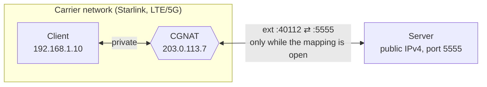
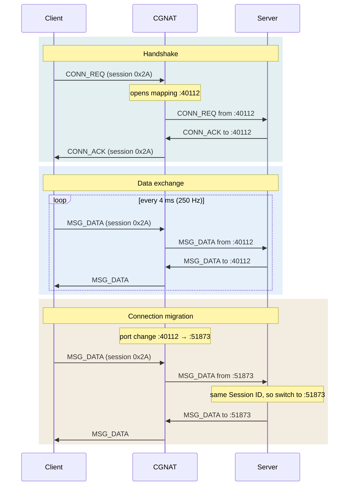

# Handshaked UDP

[](https://github.com/kewl-ua/handshaked_udp/actions/workflows/ci.yml)

A minimalist network protocol written in pure C (POSIX Sockets) for low-latency bidirectional UDP streams between a client behind carrier-grade NAT and a server with a public IP.

It handles CGNAT directly, without relying on third-party VPNs, proxies, or relay servers.

<p align="center">
  
</p>

---

## 🌐 Background & The Problem

Standard UDP communication topologies fail when one side sits behind a provider-level NAT:

1. **No Public IP on the Client:** Satellite and cellular carriers (Starlink, LTE/5G) use **CGNAT (Carrier-Grade NAT)**. The client does not have a unique external public IP address, making it impossible to establish an inbound connection from the internet.
2. **Unstable Port Mappings:** The NAT dynamically closes inactive UDP mappings and may change the client's external port mid-session.
3. **Latency-Critical Streams:** For real-time state streams only the most recent packet matters. Layering overlay networks (VPNs, WireGuard, Tailscale) or using guaranteed delivery protocols (TCP, KCP) introduces encryption overhead and jitter caused by retransmitting packets that are already stale.



---

## 🛠 Solution Architecture

Instead of utilizing an external proxy or relay server, this protocol implements dynamic session retention (**UDP Hole Punching / Keep-Alive**) directly at the application layer.

### Communication Flow:
1. **The Server** hosts a static, public IPv4 address and listens on a fixed UDP port (`5555` by default).
2. **The Client** generates a random `Session ID` and repeatedly sends `CONN_REQ` packets to the server. This outbound packet forces the NAT to map and open an ephemeral external port.
3. **The Server** receives the request, extracts the client's public IP and port via `recvfrom`, and replies with a `CONN_ACK` carrying the same `Session ID`. The Handshake is complete.
4. **Data Exchange:** The client sends `MSG_DATA` packets every 4 ms (250 Hz). The server answers each one with its own `MSG_DATA` packet to the exact address it just read. The constant outbound stream also keeps the NAT mapping alive.

### Connection Migration (Port-Hop Protection):
If the NAT drops the mapping mid-session and assigns a new external port to the client, the server sees it in the source address of the next incoming packet. The server validates the `Session ID` and sends its reply to the new address without dropping the session.



---

## ⚖️ Plain UDP vs Handshaked UDP

Plain UDP here means an application that sends datagrams to a fixed peer address, with no handshake and no keep-alive.

|                                    | Plain UDP                                 | Handshaked UDP                                              |
|------------------------------------|-------------------------------------------|-------------------------------------------------------------|
| Server → client behind CGNAT       | ✗ dropped until the client sends first    | ✓ the client opens the path with `CONN_REQ`                 |
| Client has nothing to send         | ✗ the NAT mapping expires                 | ✓ the 250 Hz stream keeps the mapping alive                 |
| NAT changes the client's port      | ✗ the server keeps sending to the old one | ✓ the server matches the `Session ID` and follows the client |
| Header overhead                    | 0 bytes                                   | 2 bytes                                                     |
| Retransmissions                    | none                                      | none: stale packets are never resent                        |

---

## 📦 Packet Structure

The header is packed down to a mere **2 bytes** to minimize overhead at high packet rates:

```text
 0                   1                   2
 0 1 2 3 4 5 6 7 8 9 0 1 2 3 4 5 6 7 8 9 0 1 2 3 ...
+-+-+-+-+-+-+-+-+-+-+-+-+-+-+-+-+-+-+-+-+-+-+-+-+-
|  Packet Type  |  Session ID   |  Payload ...
+-+-+-+-+-+-+-+-+-+-+-+-+-+-+-+-+-+-+-+-+-+-+-+-+-
```

| Packet Type    | Value  | Direction       | Payload          |
|----------------|--------|-----------------|------------------|
| `MSG_CONN_REQ` | `0x01` | client → server | none             |
| `MSG_CONN_ACK` | `0x02` | server → client | none             |
| `MSG_DATA`     | `0x03` | both            | application data |

---

## 🔧 Build & Run

Linux / POSIX with `gcc` or `clang`:

```sh
make                        # builds bin/server and bin/client
./bin/server                # on the host with the public IP, listens on UDP 5555
./bin/client 203.0.113.10   # behind CGNAT, pass the server's public IP
```

`sh tests/smoke.sh` starts both on localhost and checks that the handshake completes.

On Windows, build in the **MSYS** shell of [MSYS2](https://www.msys2.org/) (`pacman -S gcc make`). The MinGW environments have no POSIX sockets.
