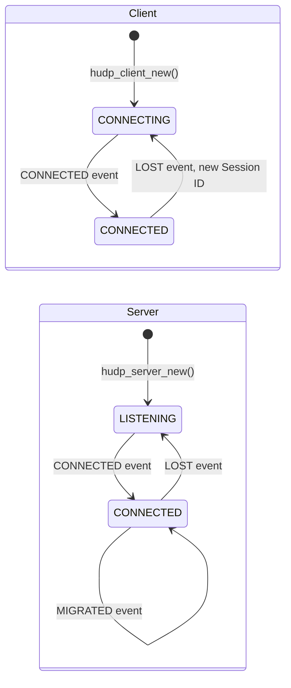

# Library Guide

> [Docs](README.md) › Library Guide

How to drive `libhudp` from your program: the event loop, how to wait, three recipes and the things worth knowing. Every function is described in the [API reference](api.md); a first complete program is in [Getting Started](getting-started.md).

## How It Works in 30 Seconds

- There are two kinds of **endpoint**. The **client** ([`hudp_client_new()`](api.md#hudp_client_new)) sits behind CGNAT and starts the conversation. The **server** ([`hudp_server_new()`](api.md#hudp_server_new)) has a public IP and waits for a client. A server talks to one client at a time.
- Your program owns the loop. In it you call **[`hudp_service()`](api.md#hudp_service)**. It reads incoming packets and does all the [protocol work](protocol.md#how-it-works): the handshake, keep-alives, noticing a dead link, reconnecting, following the client to a new port. Whatever matters to you comes back as an **[event](api.md#events)**, one per call.
- Whenever you have something to send, you call **[`hudp_send()`](api.md#hudp_send)**. Each packet travels on its own: nothing is retransmitted or reordered, because in a live stream only the newest packet matters.
- There are no threads, callbacks or background timers. Nothing happens between your calls, so you decide when the library runs. If you know [ENet](http://enet.bespin.org/), the loop will look familiar.

The [states](api.md#states) an endpoint goes through, and the events that move it:



## Waiting: the `timeout_ms` of `hudp_service()`

| `timeout_ms` | What the call does                                                   | Good for                                   |
|--------------|----------------------------------------------------------------------|--------------------------------------------|
| `-1`         | sleeps until there is an event                                        | servers that only react to the client      |
| `N > 0`      | waits up to `N` ms, returns `0` if nothing happened                   | loops that also do something periodically  |
| `0`          | never waits                                                           | fixed-rate loops that sleep on their own   |

One call returns at most one event, so in a fixed-rate loop take them all with `while (hudp_service(h, &ev, 0) > 0)`. Keep-alives and timeouts only run inside `hudp_service()`, so call it at least every [`keepalive_interval_ms`](#recipe-your-own-timings) (100 ms by default). While it waits, with `-1` or `N`, it wakes up for those timers by itself.

## Recipe: a 250 Hz Stream Where Only the Newest Packet Counts

The pattern of [`examples/client.c`](../examples/client.c): once per tick, take everything that has arrived and keep only the newest payload, send the current state, then sleep until the next tick. The [benchmark](benchmark.md) streams the same way.

```c
// stream_client.c: a 250 Hz stream that always acts on the newest packet from the server
#include <stdio.h>
#include <string.h>
#include <time.h>

#include "hudp.h"

#define TICK_NS 4000000L // 4 ms: 250 Hz

int main(void) {
    hudp_t *client = hudp_client_new("127.0.0.1", HUDP_DEFAULT_PORT, NULL);

    if (!client) {
        perror("hudp_client_new");
        return 1;
    }

    uint8_t latest[HUDP_MAX_PAYLOAD]; // The newest payload from the server
    size_t latest_len = 0;
    struct timespec next_tick;

    clock_gettime(CLOCK_MONOTONIC, &next_tick);

    while (1) {
        hudp_event_t ev;

        // 1. Take everything that arrived since the last tick. ev.data is only valid
        //    until the next hudp_service() call, so the newest payload is copied out.
        while (hudp_service(client, &ev, 0) > 0) {
            if (ev.type == HUDP_EVENT_DATA) {
                memcpy(latest, ev.data, ev.len);
                latest_len = ev.len;
            }
        }

        // 2. Act on the newest state only
        if (latest_len > 0) {
            // Hand latest[0 .. latest_len) to whatever consumes it
        }

        // 3. Send this tick's state
        if (hudp_state(client) == HUDP_STATE_CONNECTED) {
            uint8_t state[26] = {0}; // Fill with your data

            hudp_send(client, state, sizeof(state));
        }

        // 4. Sleep until the next tick. An absolute deadline does not drift,
        //    however long steps 1-3 took.
        next_tick.tv_nsec += TICK_NS;

        if (next_tick.tv_nsec >= 1000000000L) {
            next_tick.tv_nsec -= 1000000000L;
            next_tick.tv_sec += 1;
        }

        clock_nanosleep(CLOCK_MONOTONIC, TIMER_ABSTIME, &next_tick, NULL);
    }

    hudp_free(client);
    return 0;
}
```

## Recipe: Next to Other Input and Output with `poll()`

[`hudp_fd()`](api.md#hudp_fd) gives you the socket to wait on together with your own descriptors: a serial port, a pipe, stdin. Here lines typed into a server's terminal go to the client. Only wait on the descriptor; reading it is `hudp_service()`'s job.

```c
// console_server.c: lines typed on stdin go to the client, the client's payloads are printed
#include <poll.h>
#include <stdio.h>
#include <string.h>
#include <unistd.h>

#include "hudp.h"

int main(void) {
    hudp_t *server = hudp_server_new(HUDP_DEFAULT_PORT, NULL);

    if (!server) {
        perror("hudp_server_new");
        return 1;
    }

    struct pollfd fds[2] = {
        { .fd = hudp_fd(server), .events = POLLIN },
        { .fd = STDIN_FILENO, .events = POLLIN },
    };

    while (1) {
        // Wake up on network traffic or input, and at least every 50 ms for the protocol's timers
        poll(fds, 2, 50);

        hudp_event_t ev;

        while (hudp_service(server, &ev, 0) > 0) {
            if (ev.type == HUDP_EVENT_DATA) {
                printf("client: %.*s\n", (int)ev.len, (const char *)ev.data);
            }
        }

        if (fds[1].revents & POLLIN) {
            char line[256];

            if (!fgets(line, sizeof(line), stdin)) {
                break; // End of input
            }

            if (hudp_send(server, line, strlen(line)) < 0) {
                perror("Not sent"); // ENOTCONN while no client is connected
            }
        }
    }

    hudp_free(server);
    return 0;
}
```

## Recipe: Your Own Timings

Start from the defaults with [`hudp_config_default()`](api.md#hudp_config_default) and change what you need. Keep the same values on both sides.

```c
hudp_config_t cfg;

hudp_config_default(&cfg);
cfg.link_timeout_ms = 3000;       // Tolerate up to 3 s of silence before LOST
cfg.handshake_interval_ms = 100;  // Knock more often while connecting

hudp_t *client = hudp_client_new("203.0.113.10", HUDP_DEFAULT_PORT, &cfg);
```

| Field                   | Default | Meaning                                                        | Rule of thumb                                                        |
|-------------------------|---------|----------------------------------------------------------------|----------------------------------------------------------------------|
| `handshake_interval_ms` | 250     | how often a connecting client repeats `CONN_REQ`               | a bit above the round-trip time                                      |
| `keepalive_interval_ms` | 100     | send silence after which an empty keep-alive goes out          | far below the NAT's mapping timeout and below `link_timeout_ms`      |
| `link_timeout_ms`       | 1000    | receive silence after which the peer is lost (`LOST` event)    | shorter notices a dead link sooner, longer rides out loss bursts     |

Carrier NATs drop idle UDP mappings after a while; [RFC 4787](https://www.rfc-editor.org/rfc/rfc4787) asks for at least 2 minutes, but many keep them for much less. The 100 ms default is far below any of them. To see what happens when a keep-alive is slower than the mapping timeout, run the [emulator](emulator.md) with a short `--timeout`.

## Things to Know

- **No delivery guarantee and no order.** A packet can be lost, and with jitter a later one can arrive first. If order matters to you, put a counter in your payload and drop anything older than what you already have.
- **`ev.data` is borrowed.** It points into the library's buffer and is valid only until the next `hudp_service()` call on that endpoint. Copy it if you need it later.
- **Keep calling `hudp_service()`.** At least every `keepalive_interval_ms`, otherwise keep-alives stop and the NAT mapping may close.
- **One thread per endpoint.** An endpoint is not thread-safe. Different endpoints can live in different threads.
- **One client per server.** While a session is alive, a server ignores other clients. A new client is accepted once the old one has been silent for `link_timeout_ms`. See [Session Lifetime](protocol.md#session-lifetime).
- **IPv4 only, payloads up to [`HUDP_MAX_PAYLOAD`](api.md#constants) (1200 bytes).**
- **Not encrypted or authenticated yet.** See the [FAQ](faq.md#is-it-encrypted-or-authenticated).
