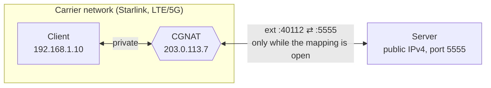
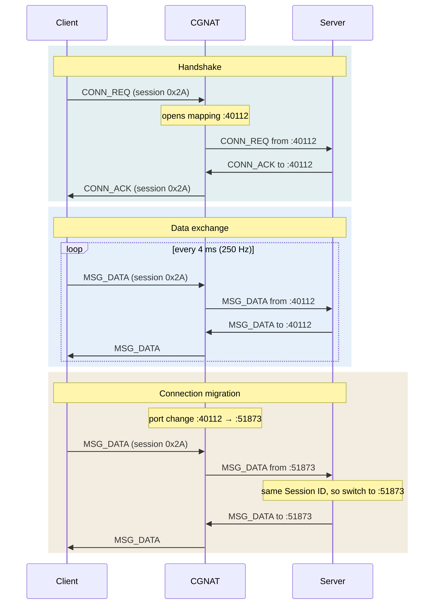

# The Protocol

> [Docs](README.md) › Protocol

Why plain UDP breaks behind carrier-grade NAT, how Handshaked UDP gets through it, and what goes over the wire. To use it from C, start with [Getting Started](getting-started.md).

## The Problem

Standard UDP communication topologies fail when one side sits behind a provider-level NAT:

1. **No public IP on the client.** Satellite and cellular carriers (Starlink, LTE/5G) use [carrier-grade NAT](https://en.wikipedia.org/wiki/Carrier-grade_NAT) ([RFC 6888](https://www.rfc-editor.org/rfc/rfc6888)). The client has no public address of its own, so nothing on the internet can open a connection to it.
2. **Unstable port mappings.** The NAT closes UDP mappings that go idle and may give the client a new external port mid-session ([RFC 4787](https://www.rfc-editor.org/rfc/rfc4787) describes how NATs treat UDP).
3. **Latency-critical streams.** For real-time state only the most recent packet matters. Overlay networks (VPNs, WireGuard, Tailscale) add a layer to run and sometimes a relay in the path, and reliable transports (TCP, KCP) add jitter by retransmitting packets that are already stale.



## How It Works

Instead of an external proxy or relay server, the protocol keeps the session alive at the application layer: the client punches the hole ([UDP hole punching](https://en.wikipedia.org/wiki/UDP_hole_punching)) and keep-alives hold it open.

### Communication Flow

1. **The server** has a static public IPv4 address and listens on a fixed UDP port (`5555` by default).
2. **The client** generates a random `Session ID` and repeatedly sends `CONN_REQ` packets to the server. This outbound packet makes the NAT open an external port for it.
3. **The server** receives the request, reads the client's public IP and port from `recvfrom`, and replies with a `CONN_ACK` carrying the same `Session ID`. The handshake is complete.
4. **Data exchange:** both sides send `MSG_DATA` packets (the example client every 4 ms, 250 Hz). The server always sends to the address the latest packet of the session came from. When a side has had nothing to send for 100 ms, it sends an empty `MSG_DATA` as a keep-alive, so the NAT mapping never goes idle. The server answers a client keep-alive at once, while the mapping it has just refreshed is sure to be open.

### Connection Migration

If the NAT drops the mapping mid-session and assigns a new external port to the client, the server sees it in the source address of the next incoming packet. The server checks the `Session ID` and sends its replies to the new address without dropping the session. The library reports it as [`HUDP_EVENT_MIGRATED`](api.md#events).



### Session Lifetime

- **Link loss:** a side that hears nothing of the session for 1 s declares the peer lost ([`HUDP_EVENT_LOST`](api.md#events)). The client then starts a new handshake with a fresh `Session ID`, so stale packets of the old session can't mix in.
- **Session protection:** while a session is alive, the server ignores `CONN_REQ` with any other `Session ID`. A restarted client is accepted once the old session has timed out.
- **Lost `CONN_ACK`:** the client keeps repeating `CONN_REQ`, and the server answers every repeat of the current session.

All three timings are configurable: [configuration](api.md#configuration).

## Packet Format

The header is packed down to **2 bytes** to keep the overhead small at high packet rates:

```text
 0                   1                   2
 0 1 2 3 4 5 6 7 8 9 0 1 2 3 4 5 6 7 8 9 0 1 2 3 ...
+-+-+-+-+-+-+-+-+-+-+-+-+-+-+-+-+-+-+-+-+-+-+-+-+-
|  Packet Type  |  Session ID   |  Payload ...
+-+-+-+-+-+-+-+-+-+-+-+-+-+-+-+-+-+-+-+-+-+-+-+-+-
```

| Packet Type    | Value  | Direction       | Payload                                  |
|----------------|--------|-----------------|------------------------------------------|
| `MSG_CONN_REQ` | `0x01` | client → server | none                                     |
| `MSG_CONN_ACK` | `0x02` | server → client | none                                     |
| `MSG_DATA`     | `0x03` | both            | application data, empty for a keep-alive |

The `Session ID` is a random number from 1 to 255 that the client picks for each handshake. The constants live in [`src/protocol.h`](../src/protocol.h). This is wire format v1; sequence numbers and authentication are planned for v2 (see the [FAQ](faq.md#is-it-encrypted-or-authenticated)).

## Further Reading

- [RFC 4787](https://www.rfc-editor.org/rfc/rfc4787): NAT behavioral requirements for unicast UDP: mappings, filtering, timeouts.
- [RFC 6888](https://www.rfc-editor.org/rfc/rfc6888): common requirements for carrier-grade NATs.
- [RFC 5128](https://www.rfc-editor.org/rfc/rfc5128): state of peer-to-peer communication across NATs, hole punching included.
- [Peer-to-Peer Communication Across Network Address Translators](https://bford.info/pub/net/p2pnat/), Ford, Srisuresh and Kegel: the classic paper on UDP hole punching.
- For two peers that are both behind NAT: [ICE (RFC 8445)](https://www.rfc-editor.org/rfc/rfc8445), [STUN (RFC 8489)](https://www.rfc-editor.org/rfc/rfc8489) and [TURN (RFC 8656)](https://www.rfc-editor.org/rfc/rfc8656). How they compare: [FAQ](faq.md#how-is-this-different-from-stun-turn-and-ice-webrtc).
